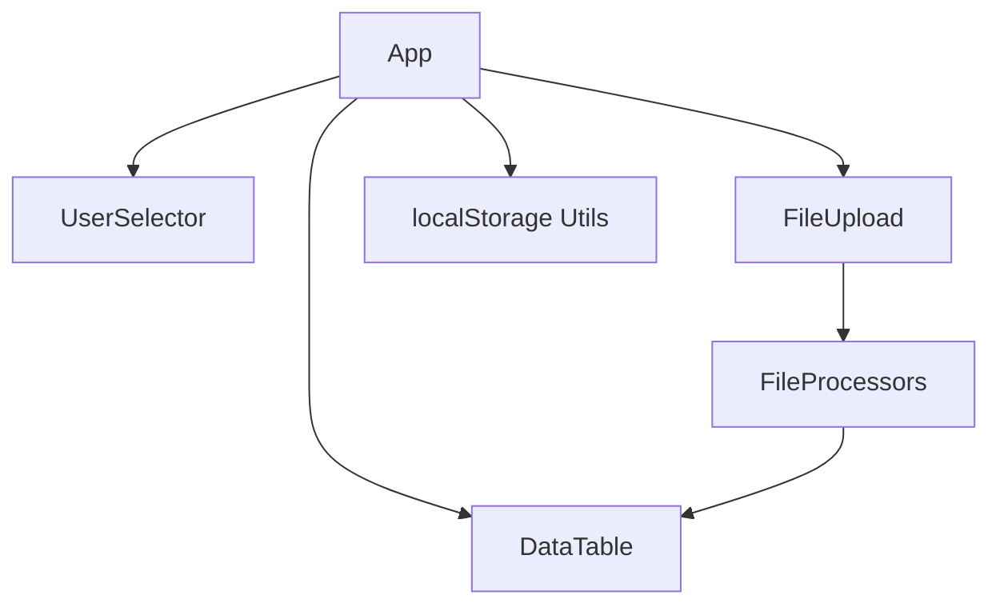

# Codebase Summary: Pole Loading Analyzer

## Key Components and Their Interactions

### Component Structure

### Components Description
- **App.tsx**: Main application component that orchestrates user selection, file processing, and data display
- **UserSelector.tsx**: Manages user profile selection and persistence
- **FileUpload.tsx**: Provides drag-and-drop file upload functionality
- **DataTable.tsx**: Displays the processed pole data in a sortable table
- **localStorage.ts**: Utilities for managing persistence across browser sessions

## Data Flow
1. User selects their profile from UserSelector
2. App loads any existing data for that user from localStorage
3. User uploads files through FileUpload component
4. App processes files using appropriate processor (Excel, PDF, CSV)
5. Processed data is stored in App state and displayed in DataTable
6. Data is simultaneously saved to localStorage for persistence
7. When user changes profile or refreshes browser, their data is retained

## External Dependencies
- **React & TypeScript**: Core framework and type system
- **@tanstack/react-table**: Powers the sortable data table
- **react-dropzone**: Enables drag-and-drop file uploads
- **lucide-react**: Provides icons for UI elements
- **Browser APIs**:
  - localStorage: For data persistence
  - File API: For file handling

## Recent Significant Changes
- Added user profile selection feature with predefined users
- Implemented localStorage persistence for user data
- Created UserSelector component for profile management
- Updated App component to handle user-specific data
- Added data persistence that survives browser refreshes and closures

## User Feedback Integration
No external user feedback has been incorporated yet, as this implementation addresses the initial requirements for:
1. Allowing users to select a profile without logging in
2. Ensuring data persists even when users refresh or close their browsers
3. Maintaining separate data for each user profile

Future iterations will incorporate user feedback on the following aspects:
- User interface improvements
- Additional data visualization features
- Export functionality for processed data
- Advanced filtering and search capabilities
